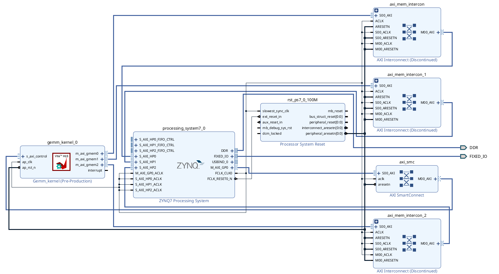

# FPGA-Based Matrix Multiplication Implementation

This repository contains the implementation and analysis of matrix multiplication (GEMM) operations on the Pynq-Z2 FPGA platform.

## Repository Structure
```
GEMM/
├── part01_gemm_vitis/                 # HLS implementations
│   ├── 00_gemm_naive/                 # Naive implementation
│   ├── 01_inner_loop_pipelined/       # Pipelined version
│   ├── 02_array_partition/            # Array partitioned version
│   └── 03_block_tiled_gemm/          # Block tiled + pipelined + partitioned
├── part02_gemm_vivado/               # Vivado project files
│   ├── gemm_vivado.cache/
│   ├── gemm_vivado.gen/
│   ├── gemm_vivado.hw/
│   ├── gemm_vivado.ip_user_files/
│   ├── gemm_vivado.runs/
│   ├── gemm_vivado.sim/
│   ├── gemm_vivado.srcs/
│   ├── drc_report.txt                # Design Rule Check report
│   ├── power_report.txt              # Power analysis report
│   ├── timing_report.txt             # Timing analysis report
│   ├── utilization_report.txt        # Resource utilization report
│   └── gemm_block_design.png         # Block design diagram
└── part03_gemm_fpga/                 # FPGA deployment files
    ├── overlays/
    │   ├── gemm.bit                  # FPGA bitstream
    │   └── gemm.hwh                  # Hardware handoff file
    ├── gemm.tcl                      # TCL script for project recreation
    └── gemm.ipynb                    # Jupyter notebook for execution
```

## Part 1: Implementation Results and Analysis

### Implementation Comparison
| Implementation | Latency (cycles) | Speedup vs Naive | BRAM | DSP | FF | LUT |
|----------------|------------------|------------------|------|-----|----|----|
| [Naive GEMM](part01_gemm_vitis/00_gemm_naive/) | 12,582,933 | 1.00x | 6 (2%) | 5 (2%) | 3,518 (3%) | 4,133 (7%) |
| [Pipelined](part01_gemm_vitis/01_inner_loop_pipelined/) | 2,181,518 | 5.77x | 6 (2%) | 5 (2%) | 49,277 (46%) | 28,498 (53%) |
| [Pipelined + Array Partition](part01_gemm_vitis/02_array_partition/) | 346,510 | 36.31x | 34 (12%) | 40 (18%) | 66,468 (62%) | 45,226 (85%) |
| [Block Tiling + Pipelined + Array Partition](part01_gemm_vitis/03_block_tiled_gemm/) | 272,057 | 46.25x | 71 (25%) | 160 (72%) | 39,308 (36%) | 36,966 (69%) |

### Analysis of Implementations

#### 1. Naive Implementation
- Baseline implementation with basic loop structures
- Lowest resource utilization but highest latency
- Limited parallelism resulting in poor performance

#### 2. Pipelined Implementation
- Achieved 5.77x speedup over naive approach
- Moderate increase in FF (46%) and LUT (53%) usage
- Maintained minimal BRAM and DSP utilization
- Timing violation observed (-1.19 slack)

#### 3. Pipelined + Array Partition
- Significant performance improvement (36.31x speedup)
- Higher resource utilization across all metrics
- Persistent timing violation (-0.91 slack)
- Enhanced memory bandwidth through array partitioning

#### 4. Block Tiling + Pipelined + Array Partition
- Best overall performance (46.25x speedup)
- Optimized resource utilization
- Resolved timing violations (no negative slack)
- Efficient block-level data management

## Part 2: IP Integration and Synthesis Reports

### GEMM IP Integration
- Successfully generated GEMM IP core
- Integrated IP into board design
- Generated bitstream for FPGA configuration

#### Block Design

The above block design shows the integration of GEMM IP with AXI interfaces and other necessary components for the Pynq-Z2 board implementation.

### Synthesis Reports
- [Power Analysis Report](part02_gemm_vivado/power_report.txt)
- [Timing Analysis Report](part02_gemm_vivado/timing_report.txt)
- [Resource Utilization Report](part02_gemm_vivado/utilization_report.txt)
- [Design Rule Check Report](part02_gemm_vivado/drc_report.txt)

## Part 3: FPGA Implementation and Performance Comparison

### Project Structure
- [`/overlays`](part03_gemm_fpga/overlays/): Contains essential FPGA configuration files
  - `gemm.bit`: Bitstream file
  - `gemm.hwh`: Hardware handoff file
- [`gemm.ipynb`](part03_gemm_fpga/gemm.ipynb): Jupyter notebook for execution and testing

### Performance Results
- Hardware GEMM (FPGA) execution time: 0.014266 seconds
- Software GEMM (Cortex-A9) execution time: 20.150390 seconds
- Achieved speedup: 1412.50x

## Conclusion
The FPGA implementation demonstrates significant performance improvements over CPU-based execution, with a 1412.50x speedup in real-world testing. The final implementation successfully balances resource utilization with performance optimization, making it highly suitable for practical applications on the Pynq-Z2 platform.